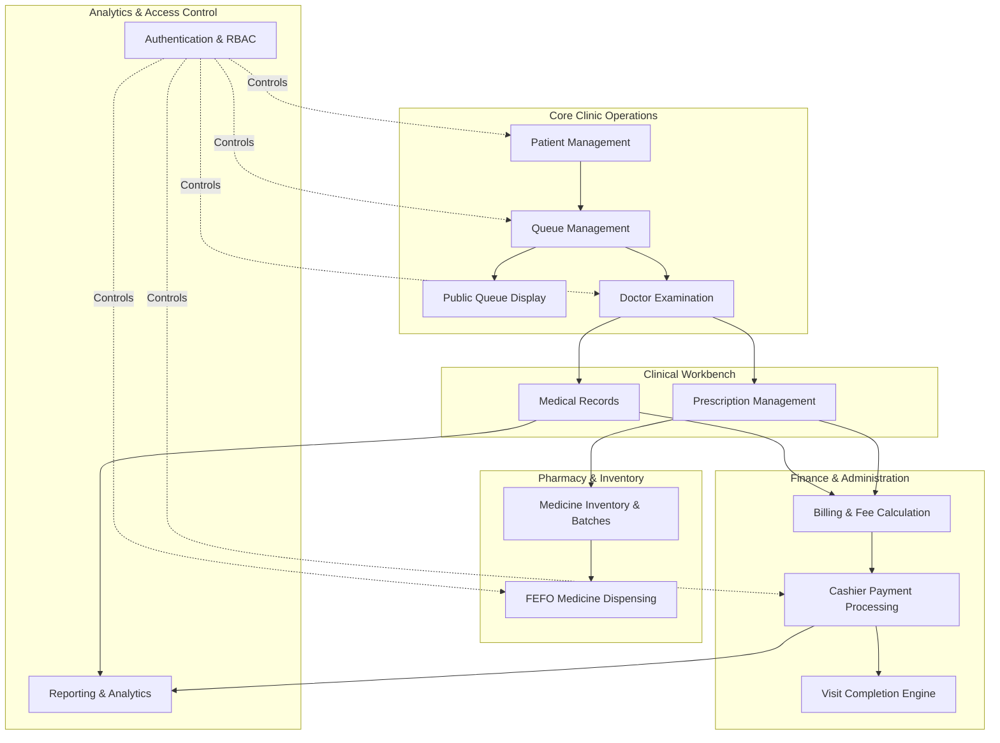
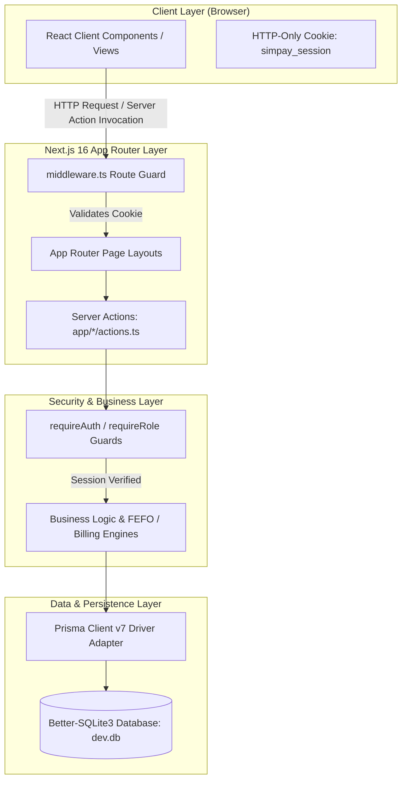
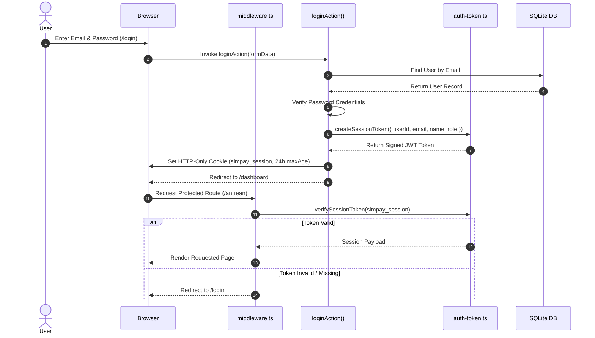
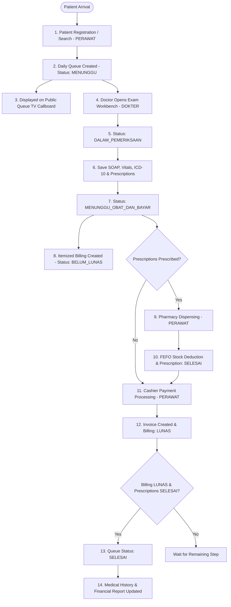
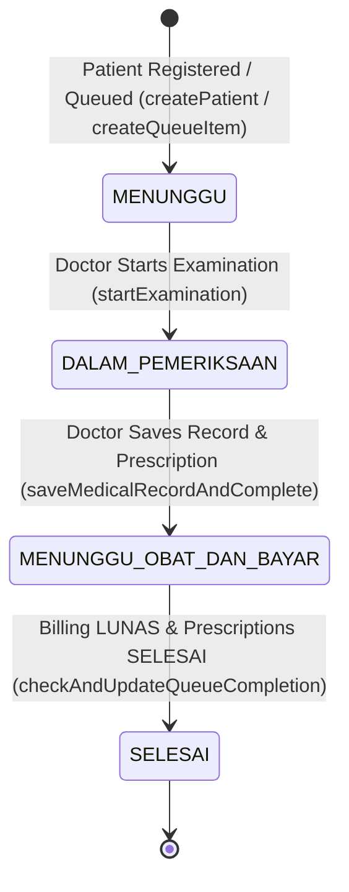
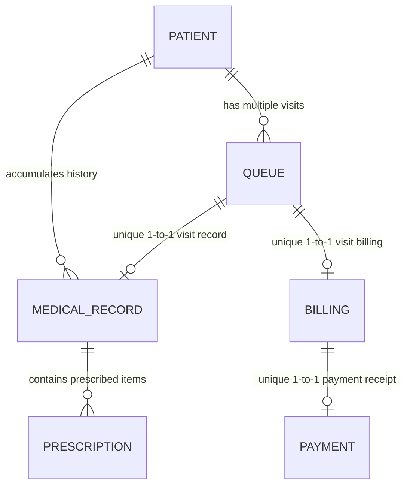
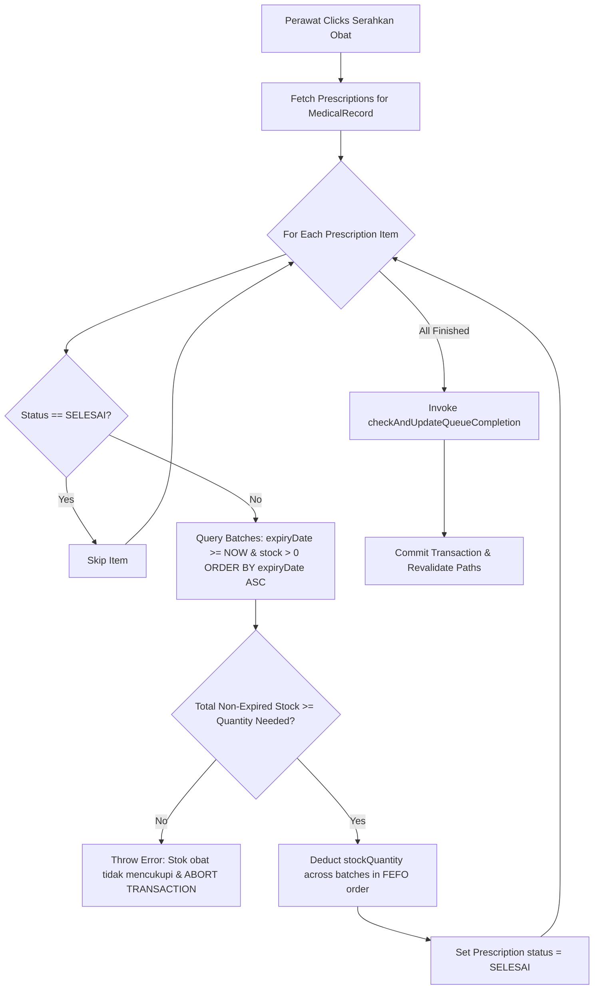
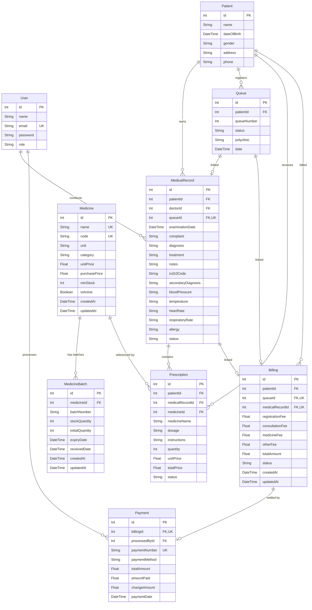

# SIMPAY — System Architecture

## 1. Document Overview

### 1.1 Purpose
This document provides the formal technical architecture specification for **SIMPAY** (*Sistem Informasi Manajemen Pelayanan, Antrean, dan Layanan Medis*). It details the system's software architecture, data models, state machines, security controls, transaction boundaries, and component interactions.

### 1.2 System Scope
SIMPAY is designed as an integrated clinic management system prototype optimized for outpatient healthcare services in small-to-medium clinics. It addresses the end-to-end patient workflow from initial intake to final checkout.

### 1.3 Prototype Context
This architecture reflects the **current codebase implementation** of the SIMPAY prototype. It serves as the authoritative reference for software engineering, academic thesis evaluation, system auditing, and future production deployment planning.

---

## 2. System Overview

SIMPAY integrates 12 major functional modules into a single cohesive Web application:

### Major Functional Areas
1. **Patient Management**: Patient directory, No. RM parsing, registration, and demographic management.
2. **Queue Management**: Polyclinic-filtered intake queues, daily sequential queue generation, and status tracking.
3. **Public Queue Display**: Dedicated unauthenticated TV callboard screen (`/antrean/display`) exposing non-sensitive queue states.
4. **Doctor Examination**: Clinical workbench for recording SOAP notes, vital signs, primary/secondary diagnoses, and ICD-10 codification.
5. **Medical Records**: Per-visit medical records tied to patient history, preventing historical record overwriting.
6. **Prescription Management**: Electronic prescription issuance with unit price snapshots from the medicine catalog.
7. **Medicine Inventory**: Catalog master data, minimum stock alerts, and multi-batch tracking with expiry monitoring.
8. **FEFO Dispensing**: Automated First-Expired, First-Out batch selection excluding expired stock with atomic rollback.
9. **Billing & Fee Calculation**: Automatic itemized fee calculation (consultation fee + snapshot prescription totals).
10. **Cashier Payment Processing**: Multi-method checkout (TUNAI, QRIS, TRANSFER), cash change calculation, and invoice generation.
11. **Reporting & Analytics**: Live database aggregation of total examinations, revenue by payment method, ICD-10 top stats, and demographics.
12. **Authentication & Authorization**: HTTP-Only signed JWT cookies, middleware route guards, and server-side role enforcement (`DOKTER` vs `PERAWAT`).

---

## 3. Technology Architecture

SIMPAY is built on the modern Node.js / React ecosystem using Next.js App Router:

| Component Layer | Technology / Package | Exact Version | Role in Architecture |
|-----------------|----------------------|---------------|----------------------|
| **Core Framework** | `next` | `16.3.4` | App Router, Server Actions, Turbopack, and SSR page rendering. |
| **UI Framework** | `react` / `react-dom` | `19.2.8` | Component rendering framework. |
| **Language** | `typescript` | `^5` | Static type checking across server actions, models, and UI props. |
| **Database ORM** | `prisma` / `@prisma/client` | `^7.10.0` | Object-Relational Mapping, migrations, and database client queries. |
| **Database Adapter** | `@prisma/adapter-better-sqlite3` | `^7.10.0` | Prisma 7 SQL driver adapter for embedded SQLite integration. |
| **Database Engine** | `better-sqlite3` | `^13.0.3` | High-performance synchronous C++ SQLite database driver for Node.js. |
| **Styling & Design System** | `tailwindcss` / `@tailwindcss/postcss` | `^4` | Utility-first CSS framework for responsive layout design. |
| **UI Components** | `@base-ui/react`, `lucide-react`, `shadcn` | `^1.7.0`, `^1.39.0`, `^4.20.1` | Accessible UI primitives, icons, and dialog design system. |
| **Authentication & Tokens** | `jose` / `crypto` (Node native) | Native / Built-in | HMAC-SHA256 JWT session tokens and password verification mechanism. |
| **Testing & Runner** | `tsx` | `^4.23.13` | TypeScript execution engine for test suites. |

---

## 4. Application Architecture

The application follows Next.js 16 App Router architecture, using **Server Actions** for mutation APIs and **Server Components** for data fetching:

### Directory Responsibilities

- **`app/`**: Application routes, pages, layouts, and Server Actions. Each domain module (`antrean`, `pasien`, `resep`, `obat`, `pembayaran`, `laporan`, `login`) contains co-located `actions.ts` files defining backend mutations.
- **`components/`**: Modular UI components grouped by feature area (`antrean`, `pasien`, `pembayaran`, `rekam-medis`, `resep`, `laporan`, `shared`, `ui`).
- **`lib/`**: Core infrastructure utilities:
  - `lib/auth.ts`: Authentication state getters, `requireAuth()`, `requireRole()`, password verification.
  - `lib/auth-token.ts`: Signed JWT session token generation and verification.
  - `lib/patient-utils.ts`: Medical Record Number (`RM-XXXXX`) formatting and parsing helpers.
  - `lib/prisma.ts`: Prisma Client instantiation with `@prisma/adapter-better-sqlite3`.
- **`prisma/`**: Database configuration, `schema.prisma`, SQL migration scripts, and seed file (`seed.ts`).
- **`tests/`**: Vitest/TSX automated regression test suites.
- **`middleware.ts`**: Edge-level route protection intercepting HTTP requests before page rendering.

---

## 5. Authentication & Session Architecture

Authentication is implemented natively using signed session tokens and HTTP-Only cookies (`lib/auth.ts`, `lib/auth-token.ts`, `middleware.ts`, `app/login/actions.ts`).

### Key Security Controls
- **Cookie Configuration**: Cookie `simpay_session` is set as `httpOnly: true`, `sameSite: 'lax'`, `path: '/'`, `maxAge: 86400` (24 hours).
- **Token Signing**: Tokens are signed using HMAC-SHA256 signature containing payload data (`userId`, `email`, `name`, `role`).
- **Logout Execution**: `clearSessionCookie()` sets `maxAge: 0`, removing the cookie from the browser client.

---

## 6. Role-Based Authorization

SIMPAY implements exactly **TWO** application roles:

1. **`DOKTER`**: Clinical practitioner role.
2. **`PERAWAT`**: Nursing, pharmacy, cashier, and operational role.

### Role-Permission Matrix

| Functional Capability | DOKTER | PERAWAT | Enforcement Mechanism |
|-----------------------|:------:|:-------:|-----------------------|
| View Dashboard & Analytics | ✅ | ✅ | `requireAuth()` |
| Register New Patient | ❌ | ✅ | `requireRole('PERAWAT')` |
| View Patient List & Medical History | ✅ | ✅ | `requireAuth()` |
| Start Doctor Examination | ✅ | ❌ | `requireRole('DOKTER')` & `middleware.ts` |
| Record SOAP, Vitals, ICD-10 | ✅ | ❌ | `requireRole('DOKTER')` |
| Write Prescriptions | ✅ | ❌ | `requireRole('DOKTER')` |
| Manage Medicine Catalog | ❌ | ✅ | `requireRole('PERAWAT')` |
| Manage Stock Batches & Adjustments | ❌ | ✅ | `requireRole('PERAWAT')` |
| Process FEFO Pharmacy Dispensing | ❌ | ✅ | `requireRole('PERAWAT')` |
| View Itemized Billing | ✅ | ✅ | `requireAuth()` |
| Process Cashier Payment | ❌ | ✅ | `requireRole('PERAWAT')` |
| View Operational Reports | ✅ | ✅ | `requireAuth()` |
| Access Public Display (`/antrean/display`) | ✅ (Public) | ✅ (Public) | Unauthenticated Public Route |

*(Note: Server-side authorization distinguishes between general authenticated access protected by `requireAuth()` and role-restricted operations protected by `requireRole()`. Client-side UI hiding is present for UX only and does not serve as the primary security boundary).*

---

## 7. Core Business Workflow

---

## 8. Queue State Machine

The queue lifecycle is governed by a explicit 4-state state machine:

### Transition Triggers & Validation Rules

1. **`MENUNGGU`**: Created automatically upon patient registration or manual queue creation by `PERAWAT`.
2. **`DALAM_PEMERIKSAAN`**: Triggered when `DOKTER` clicks *"Mulai Pemeriksaan"*. Validates that initial status is `MENUNGGU`.
3. **`MENUNGGU_OBAT_DAN_BAYAR`**: Triggered when `DOKTER` saves the examination record. Saves medical records, snapshots prescription unit prices, creates `Billing`, and updates queue status.
4. **`SELESAI`**: Triggered by `checkAndUpdateQueueCompletion()`. Updates to `SELESAI` **only** if:
   - `Billing.status === 'LUNAS'` **AND**
   - (No prescriptions exist **OR** all prescriptions have `status === 'SELESAI'`).

---

## 9. Patient & Medical Record Architecture

To prevent historical record corruption, SIMPAY decouples `Patient` demographics from individual visits:

- **Patient Multi-Visit Integrity**: A single `Patient` record can accumulate multiple `Queue` visits over time.
- **Record Isolation**: Each visit creates an independent `Queue` and `MedicalRecord` tied by `@unique queueId`. Historical visits are never overwritten when a patient returns.
- **History Retrieval**: `getPatientMedicalHistory()` queries records ordered by `examinationDate desc`, returning full SOAP history, vital sign summaries, and past prescriptions.

---

## 10. Prescription & Pharmacy Architecture

Pharmacy operations combine electronic prescription snapshotting with First-Expired, First-Out (FEFO) inventory management.

### Key Pharmacy Rules
- **Price Snapshot**: Prescriptions snapshot `unitPrice` and `totalPrice` at the time of doctor examination. Catalog price changes do not modify existing bills.
- **FEFO Order**: Batches are selected strictly by `expiryDate asc`.
- **Expired Batch Exclusion**: Batches with `expiryDate < now` are automatically filtered out.
- **Atomic Stock Deduction**: Stock deduction runs inside a Prisma `$transaction`. If stock is insufficient, the entire operation aborts without partial stock deductions.

---

## 11. Billing & Payment Architecture

### Fee Composition
$$\text{Total Amount} = \text{Registration Fee (Rp 15.000)} + \text{Consultation Fee (Rp 35.000)} + \text{Medicine Fee} + \text{Other Fee (Rp 0)}$$

- **Registration Fee**: Rp 15.000
- **Consultation Fee**: Rp 35.000
- **Base Fee Subtotal (before medicine)**: Rp 50.000
- **Medicine Fee**: Calculated dynamically from prescribed medicine items total.
- **Other Fee**: Default Rp 0.

### Payment Execution & Invoice Protection
- **Supported Payment Methods**: `TUNAI`, `QRIS`, `TRANSFER`.
- **Cash Change Calculation**: For `TUNAI`, enforces `amountPaid >= totalAmount` and calculates `changeAmount = amountPaid - totalAmount`.
- **Invoice Numbering**: Auto-generates unique formatted payment numbers: `INV-YYYYMMDD-XXXX`.
- **Duplicate Payment Rejection**: Checks `currentBilling.status === 'LUNAS'` or `currentBilling.payment != null` inside an atomic `$transaction` block to prevent double-click payment processing.
- **Financial Field Representation**: Currency fields use the Prisma `Float` numeric type as defined in [`prisma/schema.prisma`](file:///c:/Users/Think-11/simpay/prisma/schema.prisma).

---

## 12. Reporting Architecture

Reports (`app/laporan/actions.ts`) aggregate live database records without relying on mock fallbacks:

- **Date Boundaries**: Inputs are normalized to start of day (`00:00:00.000`) and end of day (`23:59:59.999`).
- **Revenue Aggregation**: Sums `Payment.totalAmount` within the date range.
- **Method Breakdown**: Groups payments by `TUNAI`, `QRIS`, and `TRANSFER` to compute counts, totals, and percentages.
- **Demographics**: Calculates patient age groups (`<18`, `18-35`, `36-50`, `51-65`, `>65`) from `dateOfBirth` relative to the report end date.
- **ICD-10 & Diagnoses**: Aggregates frequency distributions of primary ICD-10 diagnostic codes.

---

## 13. Public Queue Display Architecture

- **Route**: `/antrean/display`
- **Access Control**: Publicly accessible unauthenticated route (whitelisted in [`middleware.ts`](file:///c:/Users/Think-11/simpay/middleware.ts#L15)).
- **Privacy Enforcement**: Server Action `getPublicQueueDisplay()` selects **ONLY** `queueNumber`, `status`, `polyclinic`, and `date`. Patient names, phone numbers, addresses, diagnoses, and financial data are explicitly omitted from query select clauses.

---

## 14. Database Architecture

The database schema ([`prisma/schema.prisma`](file:///c:/Users/Think-11/simpay/prisma/schema.prisma)) defines 9 normalized models:

---

## 15. Data Integrity & Transaction Safety

SIMPAY uses Prisma `$transaction` blocks to ensure atomic ACID guarantees across multi-step operations:

1. **Patient Registration (`createPatient`)**: Atomically creates `Patient` row and daily sequential `Queue` row.
2. **Doctor Examination (`saveMedicalRecordAndComplete`)**: Atomically creates/updates `MedicalRecord`, creates `Prescription` rows, updates/creates `Billing`, and changes `Queue.status = 'MENUNGGU_OBAT_DAN_BAYAR'`.
3. **FEFO Pharmacy Processing (`processPrescriptionQueue`)**: Atomically verifies stock across non-expired batches, deducts inventory, and marks `Prescription.status = 'SELESAI'`.
4. **Cashier Payment (`processPayment`)**: Atomically re-verifies billing unpaid status, creates `Payment` row with `processedById`, and updates `Billing.status = 'LUNAS'`.

---

## 16. Security Considerations

- **Session Security**: Session tokens are signed using HMAC-SHA256 and stored in `httpOnly`, `sameSite: 'lax'` cookies.
- **Server Action Protection**: Backend operations distinguish between general authenticated access protected by `requireAuth()` (accessible to any valid session) and role-specific operations protected by `requireRole()` (enforcing `DOKTER` or `PERAWAT` permissions).
- **Public Data Sanitization**: Public callboard query (`getPublicQueueDisplay`) uses explicit field projections to prevent medical data leaks.

---

## 17. Testing Architecture

The codebase contains 5 comprehensive test suites in the `tests/` directory:

1. `auth-authorization.test.ts`: Session tokens, middleware guards, role protection (`DOKTER` vs `PERAWAT`).
2. `medicine-stock.test.ts`: Medicine creation, batch tracking, FEFO deduction, expiry filtering, and low stock alerts.
3. `billing-payment.test.ts`: Fee calculations, payment methods (TUNAI/QRIS/TRANSFER), change calculations, and duplicate payment protection.
4. `patient-history.test.ts`: Multi-visit history, patient data isolation, and vital sign panel extractions.
5. `queue-display.test.ts`: Queue state machine transitions and public display privacy projection.

**Current Test Status**: 87 / 87 automated tests passing cleanly.

---

## 18. Deployment / Runtime Notes

- **Prototype Runtime**: Running on Next.js 16 Node.js runtime with embedded SQLite (`dev.db`) via `better-sqlite3`.
- **Production Database Migration**: Moving from the current local/demo SQLite setup to a production-grade relational database (such as PostgreSQL or MySQL) would require updating the Prisma schema provider, configuring the appropriate database driver adapter, executing database migrations, and setting up production deployment infrastructure.

---

## 19. Known Limitations & Future Improvements

1. **Currency Data Type**: Currency amounts currently use Prisma `Float`. Migrating to `Decimal` or integer cents is recommended for production multi-currency environments.
2. **Configurable Alert Threshold**: Low stock and batch expiry thresholds are currently fixed in code (e.g. 30 days). Adding configurable thresholds via clinic settings will enhance flexibility.

---

## 20. Architecture Summary

| Layer | Implementation Component |
|-------|--------------------------|
| **Frontend UI** | Next.js 16 App Router, React 19 Client/Server Components, Tailwind CSS 4 |
| **Auth & Security** | HTTP-Only Signed JWT Cookies, Middleware Route Guards, Server `requireRole()` |
| **Business Logic** | Next.js Server Actions, Co-located Domain Modules, FEFO & Billing Engines |
| **Data & Storage** | Prisma ORM 7, Better-SQLite3 Driver Adapter, Embedded SQLite (`dev.db`) |
| **Testing** | TSX & Vitest Regression Suite (87 / 87 Tests Passing) |

### Implementation Status
The architecture described in this document accurately reflects the **CURRENT SIMPAY implementation**.
