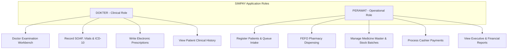
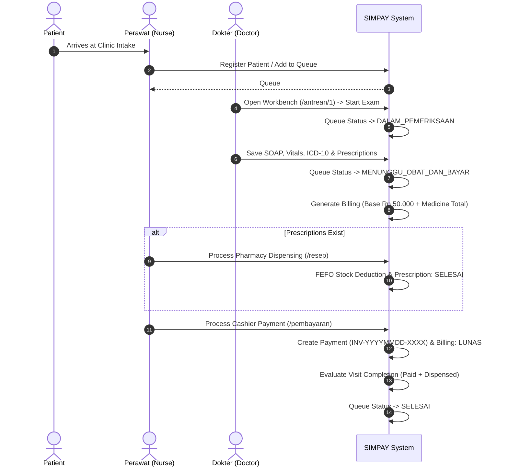
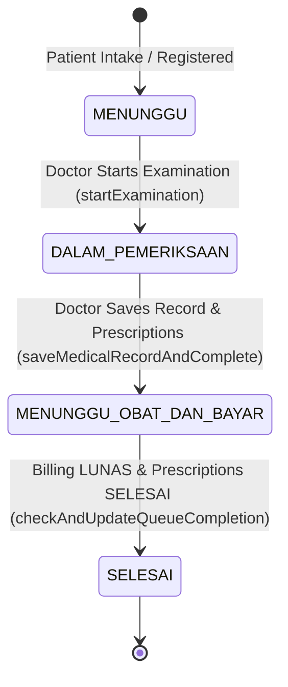

# SIMPAY — Product Requirements Document (PRD)

## 1. Product Overview

### 1.1 Product Name
**SIMPAY** (*Sistem Informasi Manajemen Pelayanan, Antrean, dan Layanan Medis*)

### 1.2 Product Purpose
SIMPAY is an integrated web-based clinic information system prototype designed to streamline healthcare service delivery, clinical examination workflows, electronic prescribing, inventory management, cashier billing, and executive reporting in small-to-medium outpatient clinics.

### 1.3 Problem Statement
Traditional paper-based or fragmented clinic administration creates significant operational bottlenecks:
- **Queue Disorganization**: Unclear patient call order and lack of public queue visibility in waiting rooms.
- **Clinical Inefficiencies**: Manual paper medical records leading to fragmented patient history and illegible prescriptions.
- **Inventory Waste**: Lack of First-Expired, First-Out (FEFO) tracking causing medicine stock expiration and manual inventory discrepancies.
- **Financial Reconciliation Bottlenecks**: Manual fee calculations and risk of duplicate or uncollected billing payments.
- **Reporting Delays**: Difficulty in aggregating daily revenue, patient demographics, and top diagnostic statistics.

### 1.4 Target Environment
Small-to-medium outpatient health clinics, primary care centers, and polyclinic practices operating with a streamlined staff model (Doctors and Nurses/Assistants).

### 1.5 Prototype Scope
This Product Requirements Document (PRD) specifies the **current implemented prototype** of SIMPAY, serving as the single source of truth for software specification, thesis defense evaluation, system verification, and future product evolution.

---

## 2. Product Goals

### 2.1 Operational Goals
- Automate patient registration and intake queue assignment.
- Provide a real-time public queue callboard for waiting room transparency.
- Track real-time visit state progression through a 4-stage queue lifecycle.

### 2.2 Clinical Workflow Goals
- Provide doctors with an integrated digital workbench for recording SOAP notes, vital signs, primary/secondary diagnoses, and ICD-10 diagnostic codes.
- Automate electronic prescription creation with snapshot unit price persistence.
- Provide multi-visit historical record isolation, ensuring past clinical history is preserved.

### 2.3 Administrative & Financial Goals
- Automate itemized billing generation combining registration, consultation, and prescribed medicine fees.
- Support multi-method cashier payment processing (`TUNAI`, `QRIS`, `TRANSFER`) with exact cash change calculation.
- Eliminate duplicate payment processing through atomic database transaction safety.

### 2.4 Security & Governance Goals
- Enforce strict role-based access control distinguishing `DOKTER` clinical activities from `PERAWAT` operational tasks.
- Protect sensitive patient medical and financial data from unauthorized public exposure.

### 2.5 Reporting Goals
- Deliver live executive reports on total examinations, revenue breakdowns, top ICD-10 codes, and patient demographics.

---

## 3. User Roles

SIMPAY implements exactly **TWO** application roles to reflect clinic staffing models:

### 3.1 DOKTER
- **Responsibilities**: Patient diagnosis, clinical treatment, medical record documentation, electronic prescribing.
- **Permitted Activities**: View today's queue (`/antrean`), access doctor examination workbench (`/antrean/[id]`), record SOAP notes and vitals, assign ICD-10 codes, create prescriptions, and view patient clinical history.
- **Restricted Activities**: `DOKTER` cannot register new patients, mutate medicine catalog/stock batches, process pharmacy dispensing, or process cashier payments.

### 3.2 PERAWAT
- **Responsibilities**: Patient registration, queue intake, pharmacy dispensing, inventory management, cashier checkout, reporting.
- **Permitted Activities**: Register new patients (`/pasien`), create polyclinic queues, review/dispense pharmacy prescriptions (`/resep`), manage medicine catalog & stock batches (`/obat`), process payments (`/pembayaran`), and view reports (`/laporan`).
- **Restricted Activities**: `PERAWAT` cannot access doctor examination workbenches (`/antrean/[id]`).

*(Note: Admin, Apoteker, Kasir, or Resepsionis roles are intentionally omitted to maintain a clean 2-role architecture).*

---

## 4. Target Users and Stakeholders

| Stakeholder / User | Description | System Interaction |
|--------------------|-------------|--------------------|
| **Clinic Doctors** | Licensed medical practitioners. | Log in as `DOKTER` to examine patients and record clinical data. |
| **Nurses & Clinic Staff** | Administrative, pharmacy, & cashier staff. | Log in as `PERAWAT` for patient intake, pharmacy, cashier, & reporting. |
| **Clinic Management** | Clinic owners & administrative leads. | View executive reports (`/laporan`) to analyze revenue and operations. |
| **Patients** | Outpatient clinic visitors. | Receive care; track queue status visually on waiting room TV screens. |
| **Public TV Viewers** | Waiting room visitors. | View unauthenticated public display (`/antrean/display`) exposing queue numbers. |

---

## 5. Core User Problems & Solutions

| Identified Problem | SIMPAY Implemented Solution |
|--------------------|-----------------------------|
| Manual paper queue chaos in waiting rooms | Automated daily sequential queue generation with polyclinic filtering and public TV callboard display (`/antrean/display`). |
| Illegible hand-written prescriptions & billing errors | Electronic prescriptions with automatic unit price snapshotting integrated into billing generation. |
| Expiry medicine waste & manual stock tracking | Multi-batch inventory tracking with FEFO (First-Expired, First-Out) stock deduction and batch expiry alerts. |
| Risk of duplicate payments or uncollected fees | Itemized billing creation with atomic transaction safety preventing double-click payments. |
| Slow manual reporting & lack of operational insights | Real-time aggregated reports covering revenue, fee breakdowns, ICD-10 diagnostic codes, and demographics. |

---

## 6. Product Scope

### 6.1 In Scope (Implemented Prototype Scope)
- 2-Role Authentication & Session Management (`simpay_session` HTTP-Only cookie, signed JWT, 24h expiry).
- Patient Directory (Registration, Update, Delete, Search by Name/Phone/Address/RM code).
- Queue Intake Engine (Daily sequential numbering, polyclinic filtering, state transitions).
- Doctor Clinical Workbench (SOAP notes, Vitals, Primary/Secondary Diagnosis, ICD-10 codes, Prescriptions).
- Electronic Prescriptions (Itemized medicine, dosage, instructions, quantity, unit price snapshot).
- Medicine Inventory & Batch Tracking (Catalog CRUD, stock quantity, min stock alert, batch expiry date tracking).
- FEFO Dispensing (First-Expired, First-Out batch selection, expired batch exclusion, atomic rollback).
- Cashier Billing & Payment (Registration Fee Rp 15k, Consultation Fee Rp 35k, Base Fee Rp 50k + Medicine Fee; TUNAI/QRIS/TRANSFER methods; change calculation; invoice generation).
- Visit Completion Engine (`checkAndUpdateQueueCompletion` enforcing Paid + Dispensed conditions).
- Patient Multi-Visit History (Reverse chronological timeline drawer, vital sign summary panel).
- Executive Reports (Live database aggregations for examinations, revenue, payment methods, ICD-10, demographics).
- Public Queue TV Display (`/antrean/display` exposing only non-sensitive queue data).

### 6.2 Out of Scope (Current Prototype Limitations)
- Multi-tenancy / multi-clinic organization management.
- External insurance (BPJS) claim gateway integrations.
- SMS / WhatsApp automated patient notifications.
- Integrated hardware barcode scanners for medicine batches.
- Electronic signatures for clinical documents.

---

## 7. Functional Requirements

### 7.1 Authentication & Session Management
- **FR-01**: System shall authenticate users via email and password (`loginAction`).
- **FR-02**: System shall issue a signed JWT session cookie (`simpay_session`) configured as HTTP-Only, SameSite Lax, with a 24-hour expiration.
- **FR-03**: System shall protect application routes via middleware, redirecting unauthenticated requests to `/login`.
- **FR-04**: System shall support explicit user logout (`clearSessionCookie`), invalidating session cookies.

### 7.2 Patient Management & Identification
- **FR-05**: System shall allow `PERAWAT` to register new patients with Full Name, Gender, Date of Birth, Phone, and Address.
- **FR-06**: System shall validate patient inputs (Name ≥2 chars, valid DOB not in future, Phone 7–13 digits).
- **FR-07**: System shall assign a formatted Medical Record Number (`RM-XXXXX`) derived from patient ID.
- **FR-08**: System shall support searching existing patients by name, phone, address, or RM number (`parseNoRM`).
- **FR-09**: System shall support updating patient details and deleting patient records (cascading linked visits in transaction).

### 7.3 Queue Management
- **FR-10**: Registering a new patient shall automatically generate a daily `Queue` record with status `MENUNGGU`.
- **FR-11**: System shall generate sequential daily `queueNumber` values per clinic day (`00:00:00` to `23:59:59`).
- **FR-12**: System shall support filtering queues by polyclinic (`Poli Umum`, `Poli Gigi`, `Poli KIA`, etc.).
- **FR-13**: System shall allow `PERAWAT` to queue returning patients for new visits.

### 7.4 Doctor Examination & Medical Records
- **FR-14**: System shall allow `DOKTER` to open waiting queue items and start examination (`DALAM_PEMERIKSAAN`).
- **FR-15**: System shall provide fields for Subjective complaint, past medical history, Objective vitals (Blood Pressure, Pulse, Temperature, Respiratory Rate, Weight, Height, SpO2), objective notes, primary diagnosis, secondary diagnosis, ICD-10 code, treatment plan, and allergy.
- **FR-16**: Saving an examination shall atomically persist `MedicalRecord`, create `Prescription` rows, create `Billing`, and update queue status to `MENUNGGU_OBAT_DAN_BAYAR`.

### 7.5 Prescription & Pharmacy Processing (FEFO)
- **FR-17**: System shall snapshot medicine `unitPrice` and `totalPrice` at the time of prescription creation.
- **FR-18**: System shall display prescription queues on `/resep` with itemized stock sufficiency indicators.
- **FR-19**: System shall allow `PERAWAT` to dispense prescriptions (`processPrescriptionQueue`).
- **FR-20**: System shall execute FEFO batch selection, sorting batches by `expiryDate asc` and excluding expired batches (`expiryDate < now`).
- **FR-21**: If stock is insufficient, system shall abort dispensing transaction with error message `"Stok obat tidak mencukupi"`, preventing partial stock deduction.

### 7.6 Medicine Inventory & Expiry Management
- **FR-22**: System shall allow `PERAWAT` to manage medicine catalog master data (name, code, unit, category, prices, min stock).
- **FR-23**: System shall allow `PERAWAT` to add stock batches (batch number, stock quantity, expiry date).
- **FR-24**: System shall highlight low stock (`stockQuantity <= minStock`) and expired/near-expiry alert badges.

### 7.7 Billing & Payment Processing
- **FR-25**: System shall generate itemized billing: Registration Fee (Rp 15.000) + Consultation Fee (Rp 35.000) = Base Fee Rp 50.000 + Medicine Fee snapshot total.
- **FR-26**: System shall allow `PERAWAT` to process payment selecting method `TUNAI`, `QRIS`, or `TRANSFER`.
- **FR-27**: For `TUNAI`, system shall validate `amountPaid >= totalAmount` and calculate cash change (`amountPaid - totalAmount`).
- **FR-28**: System shall generate unique invoice numbers (`INV-YYYYMMDD-XXXX`) and update `Billing.status = 'LUNAS'`.
- **FR-29**: System shall reject duplicate payment attempts on already-paid billings (`Duplicate Payment Rejection`).

### 7.8 Visit Completion Engine
- **FR-30**: System shall execute `checkAndUpdateQueueCompletion()` upon payment or pharmacy dispensing.
- **FR-31**: Queue status shall transition to `SELESAI` **only** when `Billing.status === 'LUNAS'` AND (no prescription exists OR all prescriptions have `status === 'SELESAI'`).
- **FR-32**: Visits without prescriptions shall transition to `SELESAI` immediately upon payment.

### 7.9 Multi-Visit Patient History
- **FR-33**: System shall present reverse-chronological multi-visit history for any patient without overwriting past clinical data.
- **FR-34**: System shall extract latest vital signs across historical visits into a summary header panel.

### 7.10 Reporting & Analytics
- **FR-35**: System shall provide executive reports on `/laporan` filtered by date range (`00:00:00` to `23:59:59`).
- **FR-36**: System shall display live aggregated metrics for examinations, queues, new patients, revenue by payment method, fee breakdown, demographics (age/gender), and top ICD-10 diagnoses.

### 7.11 Public Queue Display
- **FR-37**: System shall provide unauthenticated display route `/antrean/display` for waiting room TV screens.
- **FR-38**: System shall expose ONLY non-sensitive fields (`queueNumber`, `polyclinic`, `status`, `date`), strictly excluding patient names, medical records, and billing data.

---

## 8. Non-Functional Requirements

### 8.1 Security & Session Protection
- **NFR-01**: Session cookies shall use `httpOnly: true` and `sameSite: 'lax'` to mitigate XSS and CSRF risks.
- **NFR-02**: Passwords shall be verified securely using credentials checks.
- **NFR-03**: Server actions shall enforce role check guards (`requireRole('DOKTER')` or `requireRole('PERAWAT')`) on backend logic.

### 8.2 Data Integrity & Transaction Safety
- **NFR-04**: Multi-step entity mutations (Patient + Queue, Exam + Prescription + Billing, FEFO Dispensing, Payment + Billing Update) shall execute inside Prisma `$transaction` blocks to ensure ACID atomicity.

### 8.3 Usability & Interface Design
- **NFR-05**: Interface shall utilize modern UI design principles (Shadcn UI, Lucide icons, clear status badges).
- **NFR-06**: Navigation sidebar shall adapt dynamically based on logged-in user role.

### 8.4 Maintainability & Type Safety
- **NFR-07**: Codebase shall maintain 100% TypeScript type checking without compilation errors (`npx tsc --noEmit`).
- **NFR-08**: Application bundle shall build cleanly via Next.js production compiler (`npm run build`).

### 8.5 Automated Verification
- **NFR-09**: Automated test suite shall maintain 100% pass rate across core functional modules (`tests/`).

---

## 9. End-to-End Business Workflow

---

## 10. Queue Lifecycle State Machine

### State Transition Summary Table

| Initial State | Target State | Triggering Action | Performed By | Verification / Conditions |
|---------------|--------------|-------------------|--------------|---------------------------|
| - | `MENUNGGU` | `createPatient()` / `createQueueItem()` | `PERAWAT` | Patient exists; assigns daily `queueNumber`. |
| `MENUNGGU` | `DALAM_PEMERIKSAAN` | `startExamination(queueId)` | `DOKTER` | Verifies current status is `MENUNGGU`. |
| `DALAM_PEMERIKSAAN` | `MENUNGGU_OBAT_DAN_BAYAR` | `saveMedicalRecordAndComplete()` | `DOKTER` | Saves SOAP/vitals/ICD-10, snapshots prescription prices, creates Billing. |
| `MENUNGGU_OBAT_DAN_BAYAR` | `SELESAI` | `checkAndUpdateQueueCompletion()` | System | `Billing.status === 'LUNAS'` AND (no prescription OR all prescriptions `SELESAI`). |

---

## 11. Core Business Rules

1. **Patient Validation**: Name ≥2 chars, DOB not in future, Phone 7–13 digits.
2. **Daily Sequential Queue**: Queue numbers reset daily starting at #1 per polyclinic day.
3. **Prescription Price Snapshot**: Prescriptions snapshot unit price at doctor submission time.
4. **FEFO Inventory Rule**: Medicines are dispensed strictly from non-expired batches (`expiryDate >= now`) ordered by earliest expiry date.
5. **Atomic Stock Rollback**: If non-expired stock is insufficient, dispensing aborts completely with zero stock deducted.
6. **Billing Composition**: Base Fee = Registration Fee (Rp 15.000) + Consultation Fee (Rp 35.000) = Rp 50.000 + Medicine Fee snapshot total.
7. **Cash Payment Rule**: For `TUNAI`, `amountPaid >= totalAmount` is enforced, and cash change is calculated.
8. **Duplicate Payment Rejection**: Billings with `status === 'LUNAS'` or existing `Payment` records reject subsequent payment attempts.
9. **Dual-Condition Visit Completion**: Visits with prescriptions require BOTH payment (`LUNAS`) AND pharmacy dispensing (`SELESAI`) before transitioning to `SELESAI`. Non-prescription visits complete immediately upon payment.
10. **Multi-Visit Record Isolation**: Historical records are preserved in reverse-chronological order and never overwritten by new visits.

---

## 12. Reporting Requirements

Reports aggregate live database records without mock fallbacks:

- **Date Boundaries**: Inputs are normalized to `00:00:00.000` start and `23:59:59.999` end.
- **Operational Report**: Total examinations, total queues, new patient count, completed prescriptions.
- **Revenue Report**: Total revenue aggregated from `Payment.totalAmount`, breakdown by method (`TUNAI`, `QRIS`, `TRANSFER`), fee components (registration, consultation, medicine), and unpaid billing totals.
- **ICD-10 Diagnostic Report**: Frequency distribution of primary ICD-10 diagnostic codes.
- **Demographics Report**: Gender distribution and age group breakdown (`<18`, `18-35`, `36-50`, `51-65`, `>65`).

---

## 13. Security Requirements

- **Session Cookie**: `simpay_session` cookie configured with `httpOnly: true` and `sameSite: 'lax'`.
- **Signed Tokens**: JWT session payload signed with HMAC-SHA256 containing user metadata and role.
- **Route Protection**: Next.js `middleware.ts` intercepts protected routes and redirects unauthenticated users to `/login`.
- **Server Role Enforcement**: Server Actions invoke `requireRole('DOKTER')` or `requireRole('PERAWAT')` on backend mutation methods.
- **Public Display Sanitization**: Public callboard query (`getPublicQueueDisplay`) uses explicit field projections to exclude patient names and clinical/financial data.

---

## 14. Error & Validation Handling Matrix

| Scenario | Triggering Action | System Validation | Error / Outcome |
|----------|-------------------|-------------------|-----------------|
| Invalid Login | `loginAction()` | Email existence & credential match. | `"Email atau password salah"` |
| Short Patient Name | `createPatient()` | Name length < 2. | `"Nama pasien minimal 2 karakter"` |
| Future DOB | `createPatient()` | `dateOfBirth > now`. | `"Tanggal lahir tidak boleh di masa depan"` |
| Invalid Phone | `createPatient()` | Non-numeric or length outside 7-13. | `"Nomor telepon hanya boleh berisi angka (7-13 digit)"` |
| Insufficient Stock | `processPrescriptionQueue()` | Non-expired stock < required qty. | `"Stok obat tidak mencukupi..."` (Rollback) |
| Cash Deficit | `processPayment()` | `amountPaid < totalAmount`. | `"Uang dibayarkan kurang dari total tagihan"` |
| Duplicate Payment | `processPayment()` | `billing.status === 'LUNAS'`. | `"Tagihan/Billing ini sudah dilunasi..."` |
| Unauthorized Role | Server Action | `requireRole()` check. | `"UNAUTHORIZED: Akses ditolak..."` |
| Unauthenticated Access | Route Navigation | Cookie missing/invalid. | Redirect to `/login` |

---

## 15. UX / UI Requirements

- **Role-Oriented Navigation**: Sidebar menu automatically displays items corresponding to the user's role.
- **Status Badges**: Distinct visual badges for queue status (`MENUNGGU` blue, `DALAM_PEMERIKSAAN` amber, `MENUNGGU_OBAT_DAN_BAYAR` purple, `SELESAI` emerald).
- **Form Validation**: Real-time inline field validation feedback.
- **Receipt Printing**: Dedicated print-friendly receipt layout for payment invoices.
- **Responsive Layout**: Fluid responsive design built using Tailwind CSS 4.

---

## 16. MVP Definition

The SIMPAY Minimum Viable Product (MVP) encompasses the core end-to-end outpatient clinic workflow:
1. 2-Role Authentication & Access Control (`DOKTER` & `PERAWAT`).
2. Patient Directory & Registration with No. RM formatting.
3. Daily Queue Intake & Public TV Callboard Display.
4. Doctor Examination Workbench (SOAP, Vitals, ICD-10, Prescriptions).
5. Pharmacy Dispensing with FEFO Stock Deductions.
6. Cashier Billing & Multi-Method Payment Processing (TUNAI/QRIS/TRANSFER).
7. Executive Operational & Financial Reports.

---

## 17. Acceptance Criteria

1. **Intake Criteria**: Registering a patient generates a daily queue number and displays it on `/antrean` and `/antrean/display`.
2. **Examination Criteria**: Doctor can record SOAP, vitals, ICD-10, and prescriptions. Saving updates queue status to `MENUNGGU_OBAT_DAN_BAYAR` and generates itemized billing.
3. **Pharmacy Criteria**: Nurse can dispense prescriptions. System selects earliest expiring non-expired batch and deducts stock. Insufficient stock aborts transaction cleanly.
4. **Payment Criteria**: Nurse can process cash payment with surplus input. System calculates change, generates `INV-YYYYMMDD-XXXX`, and updates billing to `LUNAS`.
5. **Completion Criteria**: Visit automatically transitions to `SELESAI` when billing is `LUNAS` and prescriptions are `SELESAI`.
6. **Security Criteria**: `DOKTER` cannot process payments or modify medicine stock. Unauthenticated users cannot access protected routes.

---

## 18. Current Product Status

- **Automated Regression Test Suite**: 87 / 87 passing tests across authorization, billing, FEFO inventory, queue lifecycles, and patient history.
- **TypeScript Compilation**: 0 compilation errors (`npx tsc --noEmit` passes cleanly).
- **Production Build**: Compiles successfully via Next.js compiler (`npm run build` passes cleanly).
- **Epic Milestones**: Epics 1 through 11 fully completed.

---

## 19. Known Limitations & Future Improvements

1. **Currency Numeric Representation**: Financial fields currently use Prisma `Float`. Migrating to `Decimal` or integer cents is recommended for production multi-currency environments.
2. **Configurable Expiry Threshold**: Batch expiry alert threshold (currently 30 days) can be made configurable in clinic settings.
3. **Production Database Migration**: Transitioning from embedded SQLite (`dev.db`) to production PostgreSQL/MySQL will require updating schema providers, driver adapters, and deployment scripts.

---

## 20. Product Summary

SIMPAY (*Sistem Informasi Manajemen Pelayanan, Antrean, dan Layanan Medis*) successfully delivers a fully functional, secure, and thesis-ready clinic information system prototype. By combining a clean 2-role operational model (`DOKTER` and `PERAWAT`), robust clinical workbenches, FEFO pharmacy stock management, atomic cashier billing, and live executive reporting, SIMPAY provides a complete digital solution for outpatient clinic administration.
