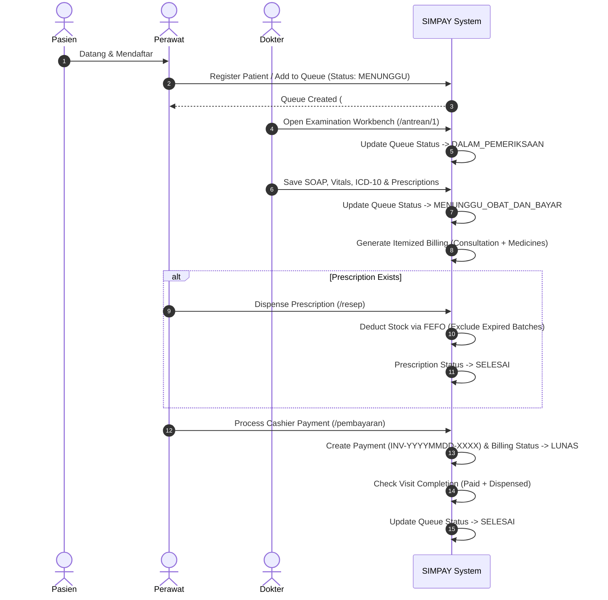
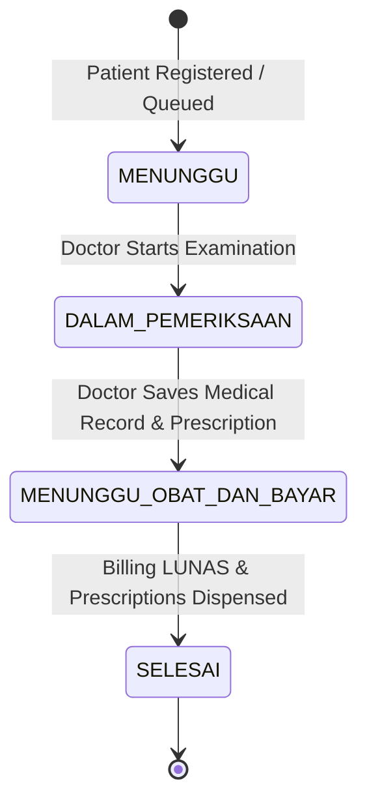

# SIMPAY — Sistem Informasi Manajemen Pelayanan, Antrean, dan Layanan Medis

SIMPAY (Sistem Informasi Manajemen Pelayanan, Antrean, dan Layanan Medis) is a web-based clinic information system prototype designed to streamline outpatient healthcare services, clinical workflows, and cashier administration.

The system manages the end-to-end patient journey, including:
- **Patient Registration**: New patient entry & returning patient search with Medical Record Number (`RM-XXXXX`) parsing.
- **Queue Management**: Real-time polyclinic queue callboard and status tracking.
- **Doctor Examination & Medical Records**: Clinical SOAP recording, vital signs, primary & secondary diagnoses, and ICD-10 codification.
- **Prescription Management**: Electronic prescription creation with automatic medicine price snapshotting.
- **Medicine Inventory & FEFO**: Inventory batch management, low-stock/expiry alerts, and FEFO (First-Expired, First-Out) stock deduction.
- **Billing & Payments**: Integrated fee calculation, cashier payment processing (TUNAI, QRIS, TRANSFER), and receipt generation.
- **Operational & Financial Reports**: Executive dashboard analytics, revenue breakdowns, ICD-10 top statistics, and patient demographic reporting.
- **Public Queue Display**: Dedicated TV callboard view (`/antrean/display`) exposing only non-sensitive queue numbers for waiting rooms.

---

## Main Features

1. **Patient Management**: Full CRUD operations for patient demographics, automatic No. RM generation, and multi-visit medical history timeline.
2. **Queue Management**: Polyclinic-filtered daily queue management with real-time status transitions.
3. **Doctor Examination & Medical Records**: Integrated doctor workbench for recording SOAP notes, vital signs, ICD-10 diagnostic codes, and treatment plans.
4. **Prescription Management**: Electronic prescription generation linked directly to patient medical records with unit price snapshot persistence.
5. **Medicine Inventory & Expiry Management**: Medicine master catalog with batch tracking, stock quantity monitoring, and low-stock/expiry alert badges.
6. **FEFO Medicine Dispensing**: Automated First-Expired, First-Out batch selection that excludes expired medicines and enforces atomic stock deductions.
7. **Billing & Payment**: Itemized billing breakdown (consultation + medicines), cash change calculation, multi-method payment handling (TUNAI, QRIS, TRANSFER), and duplicate payment rejection.
8. **Patient Medical History**: Comprehensive patient medical history timeline with keyword search across complaints, diagnoses, ICD-10 codes, and prescribed medicines.
9. **Operational & Financial Reports**: Live aggregated reports covering total examinations, revenue by payment method, fee breakdowns, age/gender demographics, and top ICD-10 diagnoses.
10. **Public Queue Display**: Standalone, responsive waiting room TV display (`/antrean/display`) that displays queue numbers while preserving patient medical privacy.
11. **Role-Based Authorization**: Two-role authorization model (`DOKTER` and `PERAWAT`) enforced at both the middleware route level and server action backend layer.

---

## User Roles

SIMPAY implements exactly **TWO** application roles to reflect small-to-medium clinic operational models without introducing administrative overhead:

### 1. DOKTER
Medical Doctors access clinical examination features to provide patient care:
- Access doctor examination workbench (`/antrean/[id]`).
- Record clinical examination data (SOAP notes, vital signs, ICD-10 codes, treatment plans).
- Create electronic prescriptions linked to medical records.
- View patient medical history and previous clinical records.

*Role Boundaries*: `DOKTER` is strictly blocked from `PERAWAT`-only operational tasks such as patient registration, medicine stock/batch creation, pharmacy dispensing, and payment processing.

### 2. PERAWAT
Nurses / Clinic Assistants handle operational, pharmacy, cashier, and administrative tasks:
- Register new patients and create daily polyclinic queues.
- Manage queue statuses and patient intake.
- Process pharmacy prescriptions and dispense medicine via FEFO batch selection.
- Manage medicine master catalog, stock batches, and inventory adjustments.
- Process cashier payments (TUNAI, QRIS, TRANSFER) and issue payment receipts.
- View financial, operational, and demographic reports.

*Role Boundaries*: `PERAWAT` is blocked from accessing doctor-only clinical examination workbenches (`/antrean/[id]`).

*(Note: SIMPAY intentionally omits separate Admin, Apoteker, Kasir, or Resepsionis roles to maintain a clean 2-role architecture appropriate for clinic workflows).*

---

## Main Business Workflow

The application models the full lifecycle of an outpatient clinic visit:



### Queue State Machine



---

## Technology Stack

The project is built on the modern React / Next.js ecosystem:

- **Framework**: [Next.js 16.3.4](https://nextjs.org/) (App Router & Turbopack)
- **UI Core**: [React 19.2.8](https://react.dev/) & [Tailwind CSS 4](https://tailwindcss.com/)
- **Icons & UI Components**: [Lucide React](https://lucide.dev/), [Shadcn UI](https://ui.shadcn.com/) primitives
- **Language**: [TypeScript 5](https://www.typescriptlang.org/)
- **Database & ORM**: [Prisma ORM 7.10.0](https://www.prisma.io/) with `@prisma/adapter-better-sqlite3` driver adapter
- **Embedded Database**: [Better-SQLite3 13.0.3](https://github.com/WiseLibs/better-sqlite3)
- **Authentication**: HTTP-Only session cookies with signed JWT tokens (`jose` & `crypto`)
- **Testing & Tooling**: [Vitest 5.0.0](https://vitest.dev/) & `tsx` 4.23.13 runner

---

## Project Structure

```text
simpay/
├── app/                      # Next.js App Router routes & Server Actions
│   ├── antrean/              # Queue management & doctor examination ([id])
│   │   └── display/          # Public queue TV display callboard
│   ├── dashboard/            # Role-specific dashboard overview
│   ├── laporan/              # Operational & financial analytics reports
│   ├── login/                # Authentication page & server actions
│   ├── obat/                 # Medicine catalog & stock batch management
│   ├── pasien/               # Patient directory & multi-visit medical history
│   ├── pembayaran/           # Cashier billing & payment processing
│   ├── rekam-medis/          # Medical record archives
│   └── resep/                # Pharmacy queue & FEFO prescription dispensing
├── components/               # React UI components & view modules
│   ├── antrean/              # Examination views & public queue callboard
│   ├── laporan/              # Interactive chart reports & summary metrics
│   ├── pasien/               # Patient forms, tables, & history drawers
│   ├── pembayaran/           # Payment processing & receipt invoice print views
│   ├── rekam-medis/          # Medical record drawers & edit dialogs
│   ├── resep/                # FEFO medicine inventory & prescription queues
│   ├── shared/               # Navigation, Header, Sidebar, & AppLayout
│   └── ui/                   # Reusable Shadcn UI primitives (Button, Card, Input, etc.)
├── lib/                      # Core backend utilities & helper modules
│   ├── auth.ts               # Server-side requireAuth & requireRole authorization guards
│   ├── auth-token.ts         # JWT session token creation & verification
│   ├── patient-utils.ts      # Medical record number (No. RM) formatting & parsing
│   └── prisma.ts             # Prisma Client initialization with SQLite driver adapter
├── prisma/                   # Database configuration & migrations
│   ├── migrations/           # Versioned SQL migration scripts
│   ├── schema.prisma         # Database models & relationships
│   ├── seed.ts               # TypeScript database seed script
│   └── seed.js               # JavaScript database seed script
├── tests/                    # Vitest & TSX integration test suites
│   ├── auth-authorization.test.ts  # Role authorization & session guards
│   ├── billing-payment.test.ts     # Cashier billing, fees, & payment processing
│   ├── medicine-stock.test.ts      # FEFO stock deduction, batch expiry, & alerts
│   ├── patient-history.test.ts     # Multi-visit medical history isolation
│   └── queue-display.test.ts       # Queue state transitions & public display privacy
├── middleware.ts             # Next.js middleware for route protection & role guards
└── package.json              # Project dependencies & scripts
```

---

## Installation & Local Setup

Follow these steps to set up and run SIMPAY locally:

### 1. Clone Repository
```bash
git clone https://github.com/Lucky230805/SIMPAY.git
cd simpay
```

### 2. Install Dependencies
```bash
npm install
```

### 3. Setup Database & Push Schema
Initialize the local SQLite database using Prisma ORM:
```bash
npx prisma db push
```

### 4. Seed Database (Demo Data & Accounts)
Populate the database with demo accounts, medicine catalog, stock batches, and sample patient visits:
```bash
npx prisma db seed
```

### 5. Run Development Server
Start the Next.js development server:
```bash
npm run dev
```
Open [http://localhost:3000](http://localhost:3000) (or the port indicated in terminal) in your browser.

---

## Demo Accounts

The database seed provides two default testing accounts representing the two application roles:

| Role | Email / Username | Password | Purpose & Capabilities |
|------|------------------|----------|------------------------|
| **DOKTER** | `dokter@simpay.local` | `password123` | Doctor workbench, SOAP recording, vitals, ICD-10, electronic prescriptions. |
| **PERAWAT** | `perawat@simpay.local` | `password123` | Patient registration, queue intake, FEFO pharmacy dispensing, stock batches, cashier payments, reports. |

> [!NOTE]
> `password123` is a local demonstration credential configured exclusively for local testing and thesis evaluation.

---

## Testing

The project includes an extensive automated test suite verifying role authorization, billing, FEFO inventory, queue lifecycles, and patient history:

### Run Individual Test Suites
```bash
# Test 1: Authentication & Server-Side Role Authorization
npx tsx tests/auth-authorization.test.ts

# Test 2: FEFO Medicine Stock, Expiry Alerts, & Batch Deductions
npx tsx tests/medicine-stock.test.ts

# Test 3: Cashier Billing, Fee Calculations, & Payment Processing
npx tsx tests/billing-payment.test.ts

# Test 4: Patient Multi-Visit History & Data Isolation
npx tsx tests/patient-history.test.ts

# Test 5: Queue State Machine & Public Display Privacy
npx tsx tests/queue-display.test.ts
```

---

## Production Build & Quality Verification

To verify TypeScript compilation and build the production bundle:

```bash
# 1. Run TypeScript type check
npx tsc --noEmit

# 2. Build Next.js production bundle
npm run build

# 3. Start production server
npm run start
```

---

## Security & Authorization Model

SIMPAY implements a multi-layered security model to protect clinical and financial data:

1. **HTTP-Only Session Cookie**: Session tokens are stored in `simpay_session` HTTP-Only cookies to prevent XSS token theft.
2. **Signed Session Tokens**: Uses JWT payloads signed with HMAC-SHA256 containing `userId`, `email`, `name`, and `role`.
3. **Session Expiration**: Sessions automatically expire after 24 hours (`SESSION_DURATION_MS`).
4. **Middleware Route Protection**: [`middleware.ts`](file:///c:/Users/Think-11/simpay/middleware.ts) intercepts requests, redirects unauthenticated users to `/login`, and restricts doctor-only routes (`/antrean/[id]`).
5. **Server-Side Action Authorization**: Server Actions enforce role checks via `requireRole('DOKTER')` or `requireRole('PERAWAT')`. Client-side UI manipulation cannot bypass backend authorization.
6. **Privacy-Protected Public Display**: Route `/antrean/display` exposes only non-sensitive queue numbers and polyclinics. Patient identities, medical records, and billing data are strictly excluded.

---

## Database Architecture

The application uses Prisma ORM 7 with SQLite. The schema ([`prisma/schema.prisma`](file:///c:/Users/Think-11/simpay/prisma/schema.prisma)) contains 9 core models:

- `User`: System accounts (`DOKTER` or `PERAWAT`).
- `Patient`: Patient demographics and identification.
- `MedicalRecord`: Clinical SOAP notes, vital signs, ICD-10 diagnostic codes, and treatment plans.
- `Queue`: Daily polyclinic queues and visit status tracking.
- `Prescription`: Prescribed medicines linked to medical records with unit price snapshotting.
- `Medicine`: Master medicine catalog (code, unit, unit price, minimum stock threshold).
- `MedicineBatch`: Inventory batches with batch numbers, stock quantities, and expiry dates.
- `Billing`: Itemized visit bills (registration, consultation, medicine, total amount).
- `Payment`: Financial transaction receipts (invoice number, payment method, amount paid, change).

---

## Development & Prototype Status

- **Epic Milestones**: Epics 1 through 11 fully implemented.
- **Automated Regression Suite**: 87 / 87 tests passing.
- **TypeScript & Build**: Zero compilation errors (`npx tsc --noEmit` & `npm run build` pass cleanly).
- **Legacy Issue Resolution**: Legacy issues #1, #3, #5, #6, and #44 fully verified and completed.

---

## Thesis Demonstration Walkthrough (10–15 Minutes Flow)

1. **PERAWAT Login**: Log in as `perawat@simpay.local` to view the nurse dashboard.
2. **Register Patient & Queue**: Register a new patient ("Ahmad Fauzi") to automatically generate Queue #1 for `Poli Umum` (`MENUNGGU`).
3. **Public TV Callboard**: Open `/antrean/display` in an incognito window to showcase the privacy-safe waiting room queue screen.
4. **DOKTER Login & Examination**: Log in as `dokter@simpay.local`, open Queue #1 (`DALAM_PEMERIKSAAN`), and record complaint, vitals, diagnosis (ISPA), ICD-10 (`J06.9`), and prescriptions.
5. **Medical Record & Billing Creation**: Save the medical record. Queue status transitions to `MENUNGGU_OBAT_DAN_BAYAR` and billing is generated.
6. **PERAWAT FEFO Pharmacy Processing**: Log in as `PERAWAT`, navigate to `/resep`, and dispense medicines. Show automatic FEFO batch selection.
7. **Cashier Payment Processing**: Navigate to `/pembayaran`, process a cash payment with surplus input, and verify change calculation & invoice generation (`INV-YYYYMMDD-XXXX`).
8. **Visit Completion**: Observe queue status automatically updating to `SELESAI` once payment is `LUNAS` and medicines are handed over.
9. **Reports & Analytics**: Open `/laporan` to demonstrate live financial revenue breakdowns, top ICD-10 code stats, and patient demographics.
10. **Role Boundary Enforcement**: Demonstrate that `DOKTER` is server-blocked from executing payments or modifying medicine stock.

---

## Important Project Notes

- **Prototype Context**: SIMPAY is a thesis prototype designed for small-to-medium clinic workflows.
- **Currency Representation**: Currency amounts use standard integer Rupiah values (IDR).
- **Local Storage**: Uses embedded SQLite (`dev.db`), ideal for standalone clinic deployments, local demonstrations, and rapid evaluation without external database dependencies.
