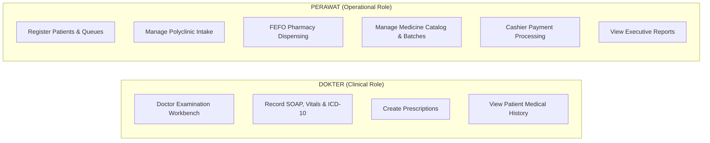
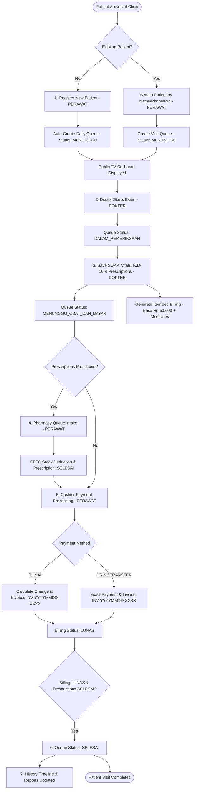
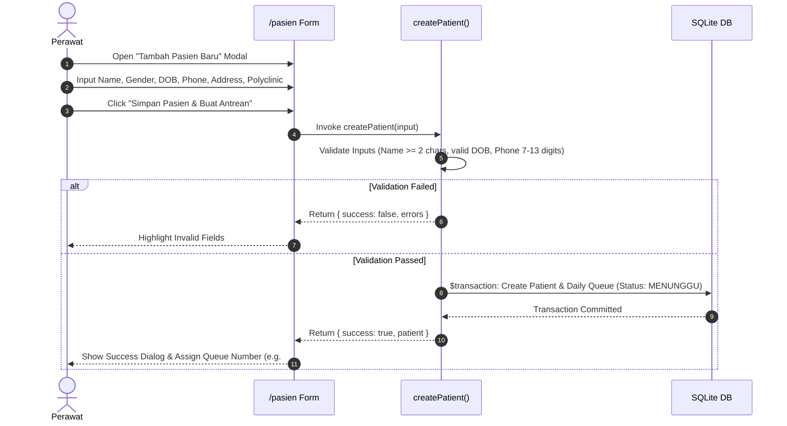
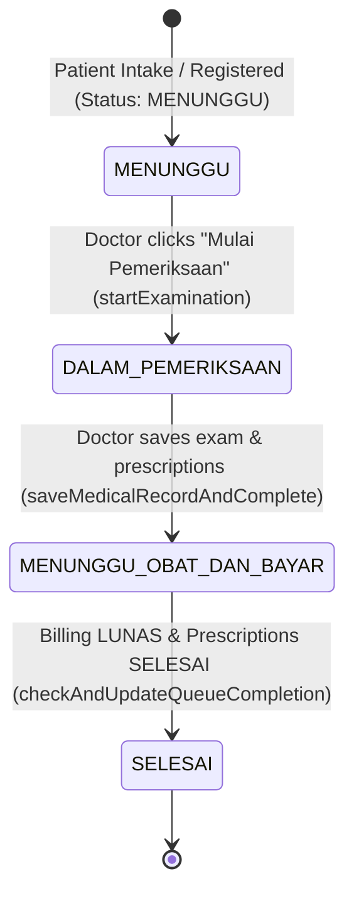
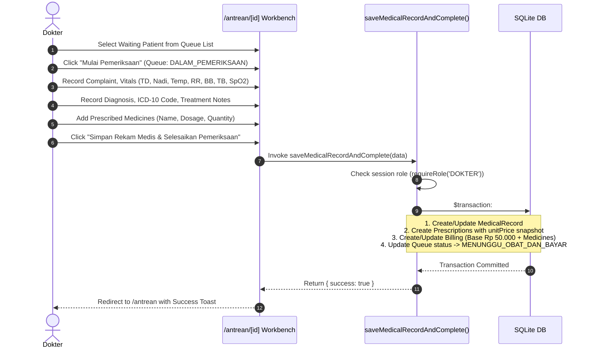
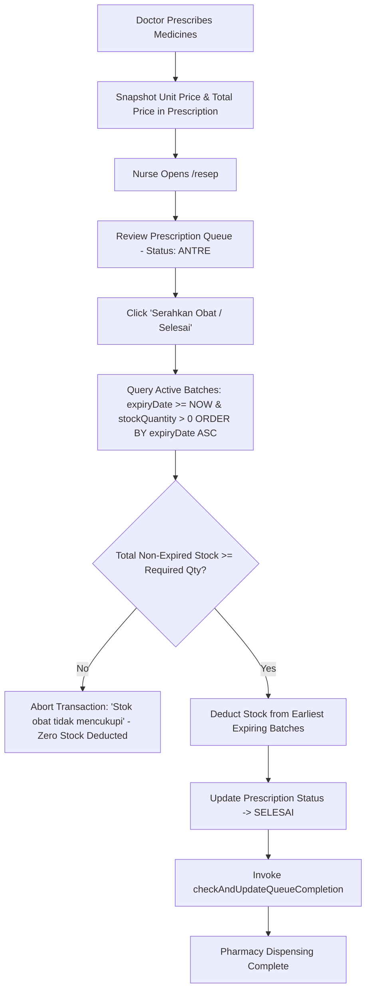
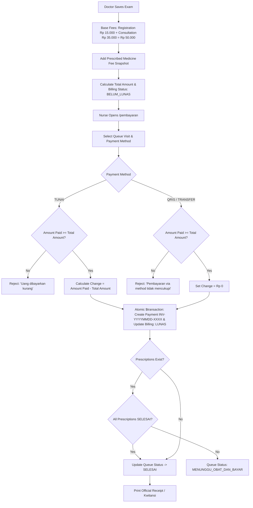
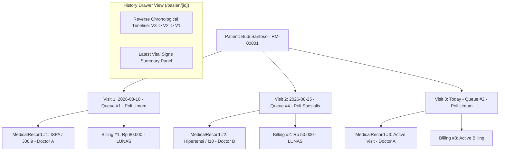
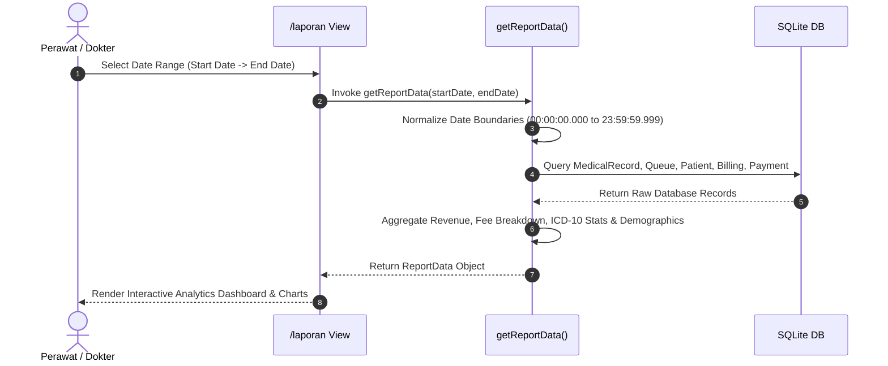
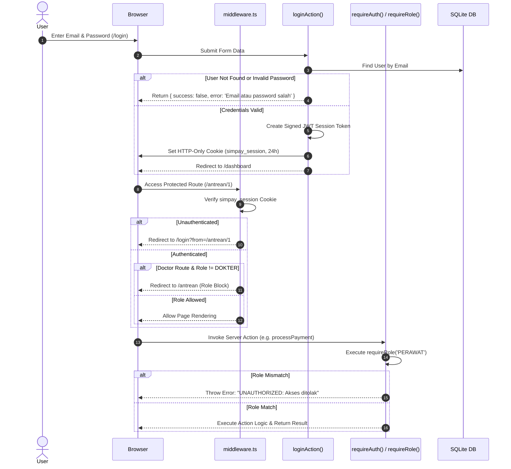

# SIMPAY — User Flow

## 1. Document Overview

### 1.1 Purpose
This document provides the complete, thesis-ready **User Flow Specification** for **SIMPAY** (*Sistem Informasi Manajemen Pelayanan, Antrean, dan Layanan Medis*). It details the step-by-step user journeys, role interactions, decision points, state transitions, and UI/backend validation behaviors across the entire outpatient healthcare lifecycle.

### 1.2 Scope
This specification covers all user-facing interactions within SIMPAY, including patient intake, polyclinic queue management, doctor examination, electronic prescription generation, FEFO pharmacy dispensing, cashier payment processing, medical history drawer views, reporting analytics, and unauthenticated public queue displays.

### 1.3 Prototype Context
The workflows documented herein accurately reflect the **current codebase implementation** of the SIMPAY prototype. It serves as an authoritative guide for user interface evaluation, academic thesis presentation, product auditing, and operational training.

---

## 2. User Roles

SIMPAY models exactly **TWO** application roles to reflect real-world clinic operations without administrative bloat:

### 2.1 DOKTER
Medical Doctors focus exclusively on clinical diagnosis and patient treatment:
- **Examination Workbench**: Access waiting patient queues (`/antrean`) and open the clinical examination workbench (`/antrean/[id]`).
- **Clinical Data Recording**: Record subjective complaints, objective vitals (blood pressure, pulse, temperature, respiratory rate, weight, height, SpO2), past medical history, primary diagnosis, secondary diagnosis, and ICD-10 diagnostic codes.
- **Electronic Prescribing**: Add prescribed medicines, dosages, and instructions linked directly to the visit medical record.
- **Patient History**: Access historical SOAP notes and past clinical visits to inform diagnosis.

*Role Restrictions*: `DOKTER` cannot register new patients, mutate medicine inventory master/batches, process pharmacy dispensing, or process cashier payments.

### 2.2 PERAWAT
Nurses / Clinic Staff handle operational, pharmacy, cashier, and administrative responsibilities:
- **Patient Registration & Intake**: Register new patients (`/pasien`), generate sequential daily polyclinic queues, or search/queue existing patients.
- **Pharmacy Dispensing**: Review prescription queues (`/resep`), verify stock, and execute First-Expired, First-Out (FEFO) medicine dispensing.
- **Medicine Inventory Management**: Manage master medicine catalog (`/obat`), create stock batches, monitor expiry dates, and manage inventory adjustments.
- **Cashier Payment Processing**: View itemized billing (`/pembayaran`), process payments via `TUNAI`, `QRIS`, or `TRANSFER`, calculate cash change, and print receipts.
- **Reports & Analytics**: View operational statistics, revenue breakdowns, top ICD-10 diagnosis charts, and patient demographics (`/laporan`).

*Role Restrictions*: `PERAWAT` cannot access doctor-only clinical examination workbenches (`/antrean/[id]`).

---

## 3. Overall Patient Service Flow

The end-to-end service journey connects patient intake, clinical care, pharmacy, cashier, and historical record-keeping:

---

## 4. Patient Registration Flow

### 4.1 New Patient Entry Validation
- **Full Name**: Required, minimum 2 characters.
- **Gender**: Must be `"Laki-laki"` or `"Perempuan"`.
- **Date of Birth**: Required, valid date format, cannot be set in the future.
- **Phone Number**: Optional; if provided, must consist of 7–13 numeric digits (`/^[0-9]{7,13}$/`).
- **Polyclinic**: Defaults to `"Poli Umum"`.

### 4.2 Automated Queue Generation
When a new patient is registered, `createPatient()` automatically counts today's queues for the date boundary (`00:00:00` to `23:59:59`), assigns `queueNumber = count + 1`, and creates a `Queue` row with `status = 'MENUNGGU'`.

### 4.3 Existing Patient Search & Queue Creation
- **Search**: `getPatients()` supports keyword searching across name, phone, address, or Medical Record Number (e.g., `RM-00001` via helper `parseNoRM()`).
- **Queueing Returning Patient**: `createQueueItem()` creates a new `Queue` entry linked to the existing `patientId` for today's date, preserving previous medical history.

---

## 5. Queue Management Flow

### 5.1 Queue Lifecycle State Diagram

### 5.2 Polyclinic Filtering & Display
- Staff can filter today's queues on `/antrean` by polyclinic (`Poli Umum`, `Poli Gigi`, `Poli KIA`, etc.).
- Summary stat cards display total queues, `MENUNGGU`, `DALAM_PEMERIKSAAN`, and `SELESAI` counts in real time.

---

## 6. Doctor Examination Flow

### 6.1 Clinical Fields Recorded
- **Subjective (S)**: Chief complaint & past medical history.
- **Objective (O)**: Vital signs (Blood Pressure `mmHg`, Pulse `x/m`, Temperature `°C`, Respiratory Rate `x/m`, Weight `kg`, Height `cm`, SpO2 `%`), physical exam notes, allergy warnings.
- **Assessment (A)**: Primary diagnosis, secondary diagnosis, and official ICD-10 diagnostic code (e.g. `J06.9`).
- **Plan (P)**: Action treatment, education notes, and electronic prescription items.

---

## 7. Prescription & Pharmacy Flow

### 7.1 Pharmacy Principles
- **Unit Price Snapshotting**: When prescribed by a doctor, `unitPrice` and `totalPrice` are stored directly in `Prescription`. Future medicine catalog price updates do NOT modify pending bills.
- **FEFO Batch Selection**: Active non-expired batches (`expiryDate >= now`) with positive stock are ordered by `expiryDate asc`. Stock is consumed from the earliest expiring batch first.
- **Atomic Insufficient-Stock Rejection**: If aggregate non-expired stock is less than required quantity, an exception is raised, triggering a complete transaction rollback. No partial deductions occur.

---

## 8. Billing & Payment Flow

---

## 9. Multi-Visit Patient History Flow

SIMPAY supports unlimited historical visits per patient while ensuring complete data isolation:

---

## 10. Reporting Flow

---

## 11. Public Queue Display Flow

- **URL Route**: `/antrean/display`
- **Access Level**: Unauthenticated Public Access (Whitelisted in `middleware.ts`).
- **Data Projection**: `getPublicQueueDisplay()` fetches **ONLY** non-sensitive queue metrics:
  - `queueNumber` (e.g., `#1`)
  - `polyclinic` (e.g., `Poli Umum`)
  - `status` (`MENUNGGU`, `DALAM_PEMERIKSAAN`, `SELESAI`)
  - `date`
- **Privacy Assurance**: Patient names, No. RM, addresses, phone numbers, clinical SOAP notes, diagnoses, prescriptions, and financial amounts are **completely excluded** from the database query projection.

---

## 12. Authentication & Authorization Flow

---

## 13. Error & Validation Handling Matrix

| Error Scenario | Triggering Action | System Validation Check | User-Facing Error Message / Outcome |
|----------------|-------------------|-------------------------|------------------------------------|
| **Invalid Login Credentials** | `loginAction()` | Email existence & password match. | `"Email atau password salah"` |
| **Short Patient Name** | `createPatient()` | Name length < 2 chars. | `"Nama pasien minimal 2 karakter"` |
| **Future DOB** | `createPatient()` | `dateOfBirth > now`. | `"Tanggal lahir tidak boleh di masa depan"` |
| **Invalid Phone Number** | `createPatient()` | Non-numeric or length outside 7–13 digits. | `"Nomor telepon hanya boleh berisi angka (7-13 digit)"` |
| **Insufficient Medicine Stock** | `processPrescriptionQueue()` | Total non-expired stock < required quantity. | `"Stok obat tidak mencukupi untuk [Nama]. Tersedia: X, Dibutuhkan: Y"` (Transaction Aborted) |
| **Cash Deficit Payment** | `processPayment()` | `amountPaid < totalAmount` for `TUNAI`. | `"Uang dibayarkan kurang dari total tagihan"` |
| **Duplicate Payment Attempt** | `processPayment()` | `billing.status === 'LUNAS'` or `billing.payment != null`. | `"Tagihan/Billing ini sudah dilunasi sebelumnya (Duplicate Payment Rejection)"` |
| **Unauthorized Role Attempt** | Server Action | `requireRole('PERAWAT')` or `requireRole('DOKTER')`. | `"UNAUTHORIZED: Akses ditolak. Fungsi ini hanya dapat diakses oleh [ROLE]"` |
| **Unauthenticated Route Access** | Navigation | Cookie `simpay_session` missing or invalid. | Middleware redirects to `/login` |

---

## 14. Thesis Demonstration Flow (10–15 Minutes)

1. **PERAWAT Login**: Log in as `perawat@simpay.local` (`password123`) to access the nurse dashboard.
2. **Patient Registration**: Register a new patient ("Ahmad Fauzi", `Poli Umum`). Show automatic No. RM generation and queue creation (#1 `MENUNGGU`).
3. **Public TV Display**: Open `/antrean/display` in a separate tab to demonstrate the privacy-protected waiting room display callboard.
4. **DOKTER Login & Examination**: Log in as `dokter@simpay.local`. Open Queue #1 (`DALAM_PEMERIKSAAN`). Enter SOAP, vitals (`120/80 mmHg`), diagnosis (`ISPA`), ICD-10 (`J06.9`), and prescriptions (`Paracetamol 500mg`).
5. **Medical Record & Billing Generation**: Save the examination. Show queue status updating to `MENUNGGU_OBAT_DAN_BAYAR` and itemized billing generated.
6. **PERAWAT Pharmacy Dispensing**: Switch to `PERAWAT`, open `/resep`, click *"Serahkan Obat"*, and demonstrate automatic FEFO batch selection.
7. **Cashier Payment Processing**: Open `/pembayaran`, select Queue #1, process a cash payment (`TUNAI`, input Rp 250.000), show change calculation (Rp 50.000), and print receipt (`INV-YYYYMMDD-XXXX`).
8. **Visit Completion**: Observe queue status automatically transitioning to `SELESAI`.
9. **Patient History & Reports**: Open `/pasien/1` to view multi-visit history, and `/laporan` to view live revenue charts and ICD-10 statistics.
10. **Role Protection Demonstration**: Attempt to process payment as `DOKTER` to demonstrate server-side role security.

---

## 15. User Flow Summary Table

| Flow Module | Primary Role | Main Output / Result |
|-------------|--------------|----------------------|
| **Patient Registration** | `PERAWAT` | New `Patient` record + Daily `Queue` (#1 `MENUNGGU`) |
| **Patient Search** | `PERAWAT` / `DOKTER` | Matches `RM-XXXXX`, name, or phone number |
| **Queue Management** | `PERAWAT` / `DOKTER` | Updates polyclinic queue state lifecycle |
| **Doctor Examination** | `DOKTER` | Saves SOAP, vitals, ICD-10, and diagnosis in `MedicalRecord` |
| **Prescription Generation** | `DOKTER` | Snapshots prescription unit prices & creates prescription queue |
| **Pharmacy Dispensing** | `PERAWAT` | Deducts inventory via FEFO & marks prescription `SELESAI` |
| **Billing Calculation** | System | Generates itemized bill (Registration Rp 15k + Consultation Rp 35k + Medicines) |
| **Cashier Payment** | `PERAWAT` | Processes `TUNAI`/`QRIS`/`TRANSFER`, calculates change, generates Invoice |
| **Visit Completion** | System | Automatically updates Queue status to `SELESAI` (Paid + Dispensed) |
| **Medical History** | `DOKTER` / `PERAWAT` | Displays reverse-chronological multi-visit clinical history |
| **Operational & Financial Reports** | `DOKTER` / `PERAWAT` | Live aggregated analytics on revenue, ICD-10, & demographics |
| **Public Queue Display** | Public (Unauthenticated) | Displays privacy-safe queue numbers on waiting room TV (`/antrean/display`) |

---

## 16. Implementation Status

This User Flow specification accurately reflects the **CURRENT SIMPAY implementation**. All workflows, role permissions, state transitions, validation checks, and security boundaries have been verified against the codebase.
